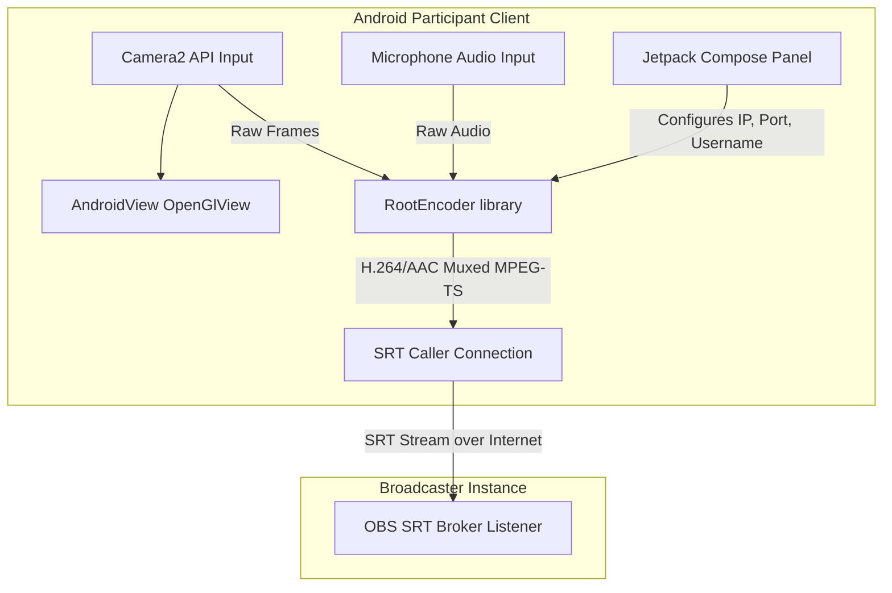

# Technical Specification: Android SRT Meeting Client App

This document outlines the design, architecture, and deployment steps for the **Android SRT Meeting Client App**. The application allows remote participants to stream camera and microphone feeds over SRT (Secure Reliable Transport) directly to the OBS Broadcaster Plugin.

---

## 1. Architectural Alignment

The Android app adheres strictly to the connection signaling scheme specified in the main technical specification:

*   **Signaling Mechanism**: SRT StreamID-based signaling.
*   **SRT Connection URL Structure**:
    `srt://<broadcaster_ip>:<port>?mode=caller&streamid=publish:<sanitized_name>&latency=120000`
*   **Encoding Scheme**: H.264 video encoding (720p @ 30 FPS, ~2 Mbps bitrate) and AAC audio encoding (128 kbps, 44.1 kHz stereo) multiplexed into an MPEG-TS container sent natively over SRT.



---

## 2. Technology Stack & Libraries

*   **Base Framework**: Jetpack Compose (UI) + ComponentActivity.
*   **SRT Streaming Library**: [pedroSG94/RootEncoder](https://github.com/pedroSG94/RootEncoder) (version `2.4.5`).
    *   *Note: Version `2.4.5` is chosen specifically to maintain compiler compatibility with `compileSdk 34` and Kotlin `1.9.x`, resolving binary metadata version limits present in newer 2.7.x releases.*
*   **Key Classes Used**:
    *   `com.pedro.library.srt.SrtCamera2`: Handles Camera2 lifecycle, video/audio encoding, and SRT connections.
    *   `com.pedro.library.view.OpenGlView`: Renders high-performance, real-time camera frames.
    *   `com.pedro.common.ConnectChecker`: Monitors connection events (`onConnectionSuccess`, `onConnectionFailed`, `onDisconnect`).

---

## 3. UI Design System (Premium Aesthetics)

The user interface follows a modern, futuristic dark theme inspired by the Catppuccin color scheme:

*   **Color Palette**:
    *   **Background**: `#1E1E2E` (Deep Dark Blue-Gray)
    *   **Surface Cards**: `#252538`
    *   **Primary Purple Accent**: `#CBA6F7`
    *   **Secondary Lavender Accent**: `#B4BEFE`
    *   **Green Output Text**: `#A6E3A1`
*   **Layout Structure**:
    1.  **Title Header**: Bold brand styling.
    2.  **16:9 Live Preview Box**: Styled with a rounded-corner clip and purple accent borders.
    3.  **Broadcaster Configuration Panel**: Material Card wrapping connection input fields.
    4.  **Control Toolbar**:
        *   **Connect & Stream Button**: Toggles between connection (Mint Green) and disconnection (Rose Pink).
        *   **Switch Camera Button**: Toggles front/back cameras instantly.
        *   **Mute Mic Button**: Mutes audio input during streams.
    5.  **Scrollable Diagnostic Console**: Real-time console that auto-scrolls, displaying timestamps and connection logs.

---

## 4. Permissions Configuration

To enable correct streaming, the app configures permissions both in the manifest and requests them dynamically at runtime:

### Manifest Declarations (`AndroidManifest.xml`)
*   `android.permission.INTERNET`: For transmitting SRT data.
*   `android.permission.CAMERA`: For capturing video frames.
*   `android.permission.RECORD_AUDIO`: For recording participant voice.
*   `android.hardware.camera` (required): Ensures target devices have a camera.

### Runtime Permissions
*   Checks permissions on startup and when resuming the app.
*   Uses `ActivityResultContracts.RequestMultiplePermissions` to request Camera + Mic dynamically.
*   Handles denial gracefully by showing explanation toast cards and logging failures.

---

## 5. Build and Execution Steps

The workspace is configured with helper scripts inside the `srtmettingapp` directory:

1.  **Dependencies & Setup**:
    Initialize build dependencies and accept SDK licenses:
    ```bash
    ./setup.sh
    ```
2.  **Build & Install to Device**:
    To compile the debug APK and automatically install it on a USB-connected Android phone:
    ```bash
    ./run.sh
    ```
