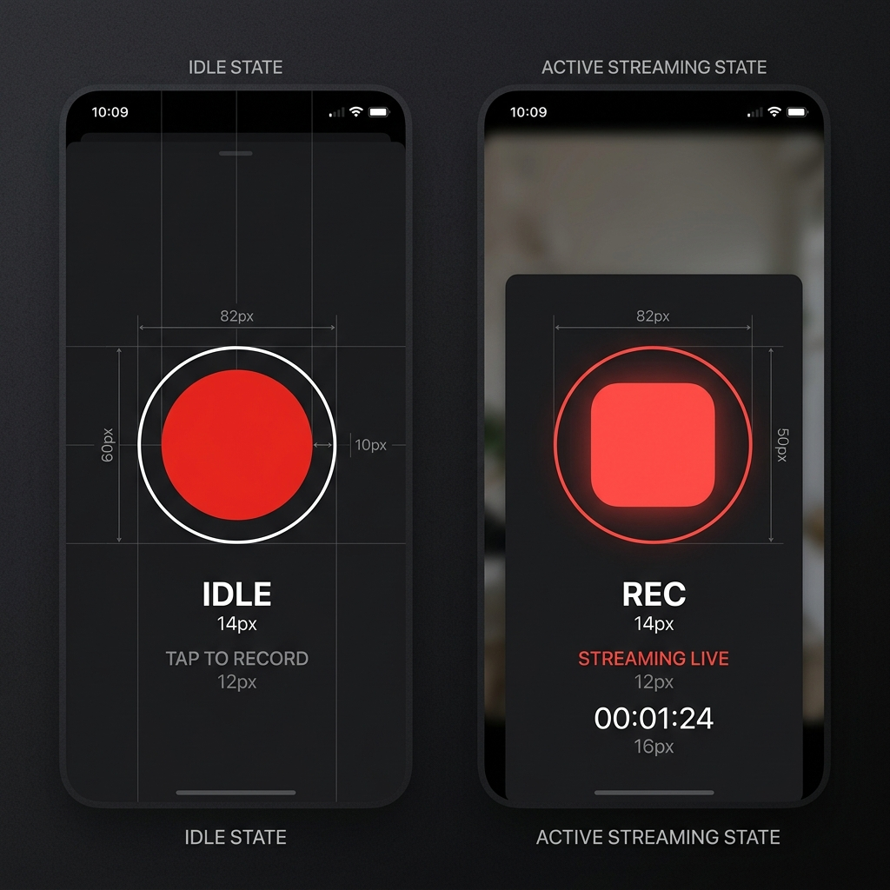

# Technical Update: Instant Stream Controls & Improved Button Animation

We have successfully updated the Android client application to align with your design specifications and improve the connection responsiveness.

## 1. Instant Connection & Disconnection Behavior (Larix-Style)

### What Changed:
*   **Immediate UI State Transition**: Previously, clicking the stop/disconnect button would wait for background network threads and callbacks to trigger `onDisconnect()` before updating the UI state (which could take several seconds or hang on high latency). We now instantly set `isStreamingState.value = false` when the action is triggered.
*   **Active Connection Feedback**: Similarly, when the user initiates a connection, the button immediately transitions to the active/connecting state (`isStreamingState.value = true`), allowing them to instantly abort the connection attempt if it takes too long. If the connection fails, it safely reverts back to the idle state.
*   **SRT URL Structure**: The application correctly formats and uses your preferred path-style SRT connection format:
    *   `srt://<ip>:<port>/publish:<name>?latency=120000`

---

## 2. Redesigned Record Button

The button has been redesigned to be simple, clean, and elegant using Compose spring-physics animations:

*   **Idle State**: A solid red circle in the center with a thin white outline, separated by a distinct gap.
*   **Active State**: A red rounded rectangle (square) in the center, with the outer outline turning red.
*   **Spring Animations**: Size changes and corner-radius morphing are executed using smooth, high-fidelity spring curves rather than standard linear timers.

### Visual Mockup:


---

## 3. Code Modifications in [MainActivity.kt](file:///home/c0mplex/Documents/Programming/cpp/obs_plugin/srtmeetingapp/android/app/src/main/java/com/meeting/srt/MainActivity.kt)

### Instant Toggle & URL Formatting in `toggleStream`:
```kotlin
    private fun toggleStream(ip: String, portString: String, name: String) {
        if (srtCamera2 == null) return

        if (isStreamingState.value) {
            logMessage("Stopping stream...")
            isStreamingState.value = false // Instant UI Update
            Thread { srtCamera2?.stopStream() }.start()
            return
        }
        ...
        val srtUrl = "srt://$ip:$port/publish:$sanitizedName?latency=120000"
        logMessage("Connecting to $srtUrl")
        isStreamingState.value = true // Instant UI Update
        srtCamera2?.startStream(srtUrl)
    }
```

### Simplified record button component with Spring animations:
```kotlin
    @Composable
    fun RecordButton(
        isStreaming: Boolean,
        onClick: () -> Unit,
        modifier: Modifier = Modifier
    ) {
        val transition = updateTransition(targetState = isStreaming, label = "recordButton")

        // Animate outer ring color (White to Red)
        val outlineColor by transition.animateColor(
            transitionSpec = {
                spring(dampingRatio = Spring.DampingRatioNoBouncy, stiffness = Spring.StiffnessMedium)
            },
            label = "outlineColor"
        ) { streaming ->
            if (streaming) Color(0xFFE24B4A) else Color.White
        }

        // Animate center button size (54.dp to 32.dp)
        val centerSize by transition.animateDp(
            transitionSpec = {
                spring(dampingRatio = Spring.DampingRatioMediumBouncy, stiffness = Spring.StiffnessLow)
            },
            label = "centerSize"
        ) { streaming ->
            if (streaming) 32.dp else 54.dp
        }

        // Animate center button corner radius (27.dp to 8.dp)
        val centerCornerRadius by transition.animateDp(
            transitionSpec = {
                spring(dampingRatio = Spring.DampingRatioMediumBouncy, stiffness = Spring.StiffnessLow)
            },
            label = "centerCornerRadius"
        ) { streaming ->
            if (streaming) 8.dp else 27.dp
        }

        Box(
            modifier = modifier
                .size(80.dp)
                .clickable(
                    interactionSource = remember { MutableInteractionSource() },
                    indication = null,
                    onClick = onClick
                ),
            contentAlignment = Alignment.Center
        ) {
            // Outer ring border
            Box(
                modifier = Modifier
                    .size(76.dp)
                    .border(4.dp, outlineColor, CircleShape)
            )

            // Inner center button
            Box(
                modifier = Modifier
                    .size(centerSize)
                    .background(
                        color = Color(0xFFE24B4A),
                        shape = RoundedCornerShape(centerCornerRadius)
                    )
            )
        }
    }

---

## 4. Resolved Crash: `VideoEncoder not prepared yet`

### Root Cause:
When the SRT connection stops (either manually via user click, due to connection failures, or because the app is paused/closed), the RootEncoder library releases the media encoders internally. 
However, the state variable `encodersReady` was never set back to `false` when these disconnect events occurred. As a result, subsequent connection attempts skipped encoder preparation and called `startStream()` directly, throwing a fatal `IllegalStateException: VideoEncoder not prepared yet`.

### Implementation:
We ensured that `encodersReady = false` is set on every stop path:
*   In **`onPause()`** when releasing the camera preview.
*   In **`onConnectionFailed()`** when a connection fails to establish.
*   In **`onDisconnect()`** when a server connection closes.
*   In **`toggleStream()`** when stopping the stream manually.

---

## 5. Screen Rotation & Popup UI Controls

To support screen rotation and maximize the camera viewport, the entire UI layout has been redesigned to use a clean, overlay HUD (Heads-Up Display) layout:

### Key Design Changes:
1.  **Immersive Fullscreen Preview**: The camera view now occupies the entire screen background (`Modifier.fillMaxSize()`).
2.  **Configuration Dialog**: The input fields for Broadcaster IP, SRT Port, and Display Name are moved out of the main screen into a connection settings popup dialog, opened via a **Gear icon** button.
3.  **Logs Popup Dialog**: The scrolling diagnostics panel is moved into a console popup dialog, opened via a **List icon** button, complete with a "Clear Logs" button.
4.  **Auto-Adaptive Controls Panel**:
    *   **Portrait mode**: Controls (Settings, Mic, Record Button, Switch Camera, Logs) align horizontally in a clean row at the bottom edge.
    *   **Landscape mode**: Controls align vertically in a column along the right edge of the screen.
5.  **Custom Lightweight `MicIcon`**: Designed and built a custom Canvas-drawn microphone icon (with unmuted/muted slash states) to avoid importing the heavy `material-icons-extended` dependency, keeping build times fast and memory footprint minimal.

